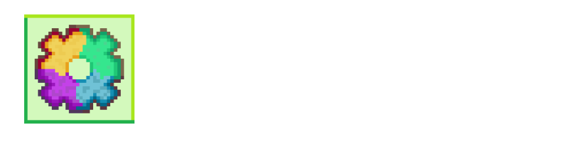

<p align="center">
  
</p>

# Terragear

[](https://github.com/lunauii/terragear/releases)
[](https://github.com/lunauii/terragear/blob/main/LICENSE)


> [!WARNING]  
> Archived. Will port to C# in the future.

Terragear is an interactive one-size-fits all guide for the video game Terraria.

##### __Table of Contents__
> - [Running Terragear](#running-terragear)
> - [Developing Terragear](#development)
>    - [Downloading the source code](#downloading-the-source-code)
> - [Feedback](#feature-requests-and-bug-reports)
> - [License](#license)
> - [FAQ](#terragear-faq)

Terragear is in heavy development but is mostly stable, except on certain Android devices.
If you would like to contribute, please read more.

## Running Terragear
**Latest build:**

| [Windows 7+ (x64)](https://github.com/lunauii/terragear/releases/latest) | [Chrome 77+, Edge 79+, Opera 73+, Firefox 75+ (Partial Support)](https://lunaui.itch.io/terragear) |
| ------------- | ------------- |

If your platform is not listed above, you may have to wait for future releases.
**NOTE:** On Android web, using the guide search bar is _highly unstable_ at the moment, due to VirtualKeyboards working really weirdly on web. Please try to minimize use of it if you can.

## Development

To easily develop on Terragear, you must meet the following prerequisites:
- [Godot 4.0+](godotengine.org/download/) or [Godot Engine Web Editor _(not recommended)_](https://editor.godotengine.org/releases/latest/)

and additionally the following if you plan to export/build the project:
- [rcedit _(exporting to Windows)_](https://github.com/electron/rcedit/releases)
- [WINE _(Godot for Mac/Linux)_](https://www.winehq.org)

### Downloading the source code

Clone the repository:

```shell
git clone https://github.com/lunauii/terragear
cd terragear
```
To update the repository, execute the following code in the `terragear` directory: 

```shell
git pull
```

You can then open Godot Engine and open the `terragear` directory as a new project.

## Feature Requests and Bug Reports

To help out with Terragear development, you can either [report issues](https://github.com/lunauii/terragear/issues) (bugs/suggestions) or [submit pull requests](https://github.com/lunauii/terragear/pulls) (your own code).

## License

Terragear's code is covered by the [MIT licence](https://opensource.org/licenses/MIT). Please see [the licence file](LICENCE) for more information. [tl;dr](https://tldrlegal.com/license/mit-license).

Please note that Jason's Guides are still protected under copyright law, and are not available for commercial use.

## Terragear FAQ:

#### Why isn't it loading for me? All it displays is a black screen/indefinite loading screen.

If you are on an Apple device (iOS, iPad OS, MacOS) this is due to Apple deprecating support for OpenGL 2.0. Currently, Godot 4.0 has no solution for this unlike previous versions due to upstream issues, so you may have to wait a few months until Godot updates to get it to work.
If you are not on Apple, please raise a bug report here: https://github.com/lunauii/terragear/issues

#### When searching up a guide Terragear crashes!

If you are on Android, this is due to VirtualKeyboard support for web browsers being _veeery_ experimental at this point of time. I will try to find a solution, and will probably just make an app for Android instead.

#### What was this coded in?

I used Godot 4 and its built in language, GDScript. For deploying online, I used GitHub Pages and itch.io, and exported the tool as a web app.
